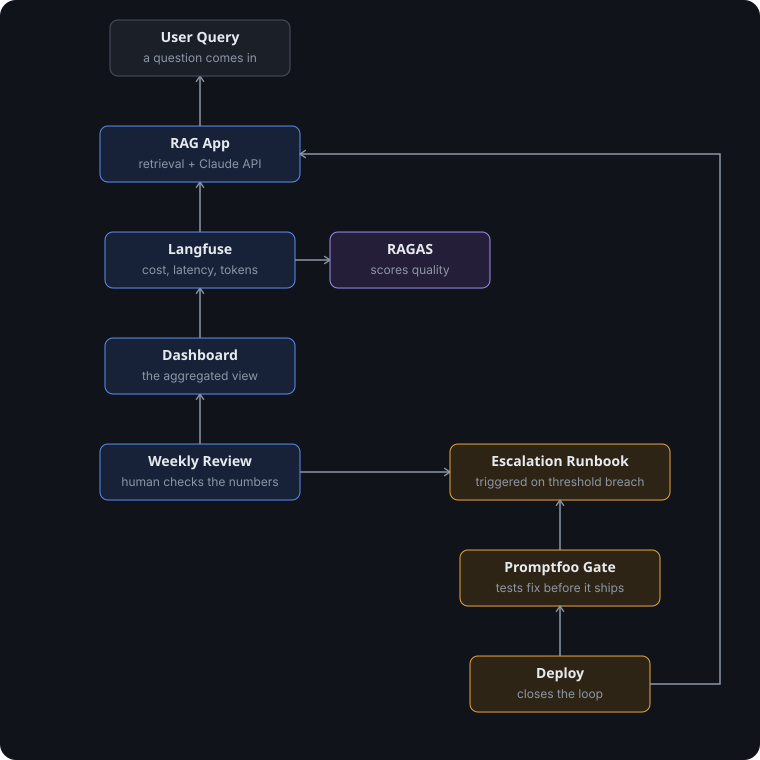

# model-perf-ops

Operationalizing model performance for a RAG assistant.

## Status

**Built and committed (Phases 0-8):**
- A small RAG assistant answering questions over a document set, using Claude Haiku
- Langfuse instrumentation, every request traced for cost, latency, and token usage
- RAGAS scoring for automated quality checks (faithfulness, answer relevancy, context precision)
- Defined thresholds and a written escalation runbook for when something breaks
- Promptfoo as a launch gate, comparing old vs new versions before anything ships

**Planned next (not yet built):**
- A weekly review cadence, with real filled-out examples of data leading to a decision
- Prompt caching and Batch API calls to cut cost
- Automated alerting (Slack/email) on threshold breaches, instead of manual dashboard checks
- Real embedding-based retrieval, replacing the current keyword-overlap placeholder
- Promptfoo wired into GitHub Actions, running the launch gate on every push
- A documented before/after cost comparison once the optimization phases land

## How it works

The operational loop: a query runs through the app, gets traced and scored automatically, reviewed weekly, and any fix has to pass the launch gate before it redeploys.

